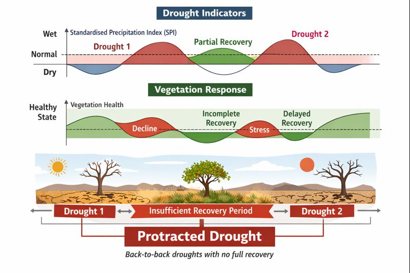

# Protracted Drought Project

Droughts are commonly identified as isolated events based on precipitation deficits over a defined time window. However, in many regions, drought impacts are not driven by a single dry episode, but by repeated or closely spaced drought events that occur before ecosystems have fully recovered from earlier stress. These compounded conditions can lead to prolonged ecological degradation, reduced resilience, and delayed recovery.

## Approach Used in This Project

Meteorological drought detection using the Standardised Precipitation Index (SPI)
Vegetation condition and recovery assessment using satellite-derived indicators
Rule-based recovery criteria to determine when ecosystems return to baseline conditions
Deep learning models to learn spatial and temporal patterns associated with protracted drought occurrence

